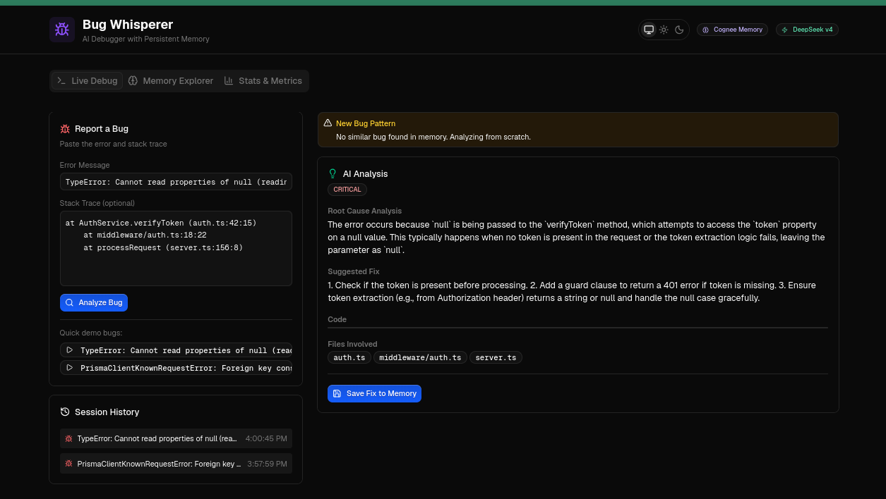

# Bug Whisperer



An AI debugger with persistent memory that gets smarter every time you fix a bug. Built for the **"The Hangover Part AI" Hackathon** by WeMakeDevs x Cognee.

> **AI Assistant Disclosure (Rule 8):** This project was built with assistance from Claude (Anthropic) via the pi coding agent for architecture design, code generation, and debugging. All core logic, Cognee integration patterns, and demo flow were human-directed and reviewed.

**Track:** Best Use of Open Source (Self-Hosted Cognee) — MacBook Neo

---

## Table of Contents

- [What It Does](#what-it-does)
- [Quick Start](#quick-start)
- [CLI Usage](#cli-usage)
- [Web Dashboard](#web-dashboard)
- [How Cognee Powers This](#how-cognee-powers-this)
- [Project Structure](#project-structure)
- [Tech Stack](#tech-stack)
- [Testing on Local Projects](#testing-on-local-projects)
- [License](#license)

---

## What It Does

Developers spend a significant portion of their time debugging the same patterns of bugs across sessions. AI coding assistants reset with every conversation, losing all context about past fixes. Bug Whisperer solves this by giving AI persistent memory of every bug you encounter.

When you hit an error, Bug Whisperer searches its Cognee-powered memory for similar past bugs. If a match is found, it instantly recalls the root cause and fix. If not, it analyzes the bug from scratch using DeepSeek and stores the solution for next time. The knowledge graph grows with every session, making the system demonstrably smarter over time.

---

## Quick Start

### Prerequisites

- Python 3.10+
- Node.js 20+ and Bun
- A DeepSeek API key (or any OpenAI-compatible LLM)

### Setup

```bash
git clone git@github.com:imadnan4/Bug-Whisperer.git
cd Bug-Whisperer
```

#### 1. Backend

```bash
cd backend
cp .env.example .env
# Edit .env with your LLM_API_KEY

uv venv
source .venv/bin/activate
uv pip install cognee fastapi uvicorn pydantic python-dotenv httpx "cognee[fastembed]"
uvicorn src.main:app --port 8000
```

#### 2. CLI

Install directly from GitHub:

```bash
pip install git+https://github.com/imadnan4/Bug-Whisperer.git#subdirectory=backend
```

Then set your environment variables and use it anywhere:

```bash
export LLM_API_KEY=your_key_here
export LLM_ENDPOINT=https://api.deepseek.com/v1

# Point to deployed backend (or skip for localhost)
export BW_API_URL=https://backend-production-efdc.up.railway.app

bw analyze "TypeError: Cannot read properties of null"
```

Or install locally for development:

#### 3. Web Dashboard

```bash
cd frontend
bun install
bun run dev
# Open http://localhost:3000
```

---

## CLI Usage

The `bw` command is the primary interface for developers who live in the terminal.

### Analyze a Bug

```bash
bw analyze "TypeError: Cannot read properties of null (reading 'token')"

# With stack trace and language hint
bw analyze "null has no property 'id'" --stack "at UserService.getUser (auth.ts:65:10)" --lang typescript

# With file context
bw analyze "KeyError: 'cache_key'" --files "app/cache.py,app/models.py" --lang python

# Raw JSON output for scripting
bw analyze "Segfault in process" --json
```

### Pipe Errors from Any Command

The pipe command reads from stdin, automatically extracts errors from the output, and analyzes each one. This is the most natural workflow for developers.

```bash
# Pipe test failures
npm test 2>&1 | bw pipe --lang typescript

# Pipe Python errors
python main.py 2>&1 | bw pipe --lang python

# JSON output for CI/CD integration
pytest 2>&1 | bw pipe --json
```

Supported language patterns: Python (tracebacks), JavaScript, TypeScript, and a generic fallback for any error output.

### Save Fixes to Memory

Every analysis auto-saves to memory. Use `bw remember` to manually log a fix:

```bash
bw remember "Missing null check before token access" "Add guard clause with optional chaining" \
  --code "const token = user?.token ?? null" \
  --files "middleware/auth.ts"
```

### View Statistics

```bash
bw stats
```

Shows total bugs, recall hit rate, average match confidence, time saved, most common error types, and most problematic files. Both CLI and dashboard stay in sync — analyze from the terminal, browse history in the browser.

---

## Web Dashboard

The dashboard provides a visual interface with three tabs.

### Live Debug

Paste an error message and stack trace, click "Analyze Bug." Bug Whisperer checks its memory and displays the root cause analysis, suggested fix, code snippets, and related files. Every analysis is auto-saved to the knowledge graph.

### Memory Explorer

Browse every bug that has been analyzed. Each entry shows the full error, root cause, fix, files involved, and whether it was found in memory or newly analyzed. Expand any entry to see complete details.

### Stats and Metrics

Real-time dashboard with meaningful metrics: total bugs, recall hit rate, average match confidence, time saved, most common error types, and most problematic files. The recall performance bar proves the agent gets smarter over time.

---

## How Cognee Powers This

Bug Whisperer uses Cognee's hybrid graph-vector memory layer through four core operations.

| Cognee API | What It Does | How We Use It |
|------------|-------------|---------------|
| `remember()` | Ingests data, extracts entities, builds knowledge graph with vector embeddings | Auto-saves every bug analysis as structured graph nodes |
| `recall()` | Hybrid search — semantic vectors find similar errors, graph traversal follows relationships to root causes and fixes | Searches past bugs when a new error occurs |
| `improve()` | Post-ingestion enrichment, adjusts node weights based on feedback | Strengthens fix confidence when a fix works, weakens when it doesn't |
| `forget()` | Removes specific nodes or datasets | Cleans up outdated or incorrect fixes |

### Knowledge Graph Structure

Each bug becomes a node connected by relationships.

```
Error: "TypeError: Cannot read null.token"
  - Type: NullReferenceError
  - File: middleware/auth.ts
  - Root Cause: Missing null check before property access
  - Fix: Add guard clause with optional chaining
  - Related Errors:
      "null has no property 'id'"
      "Cannot destructure property of null"
```

The vector store handles semantic similarity (finding "null has no property 'id'" from "Cannot read null.token"), while the graph store handles structural relationships (following Error to Root Cause to Fix to Related Files).

---

## Project Structure

```
Bug-Whisperer/
  backend/
    src/
      main.py              FastAPI server with four endpoints
      memory.py            Cognee operations and stats tracking
      models.py            Pydantic data models
      cli.py               CLI tool with analyze, pipe, remember, stats
    data/stats.json        Persistent bug counter and entry log
    .env.example           Configuration template
    pyproject.toml         Package config with bw entry point
  frontend/
    src/
      app/
        page.tsx           Main dashboard with three tabs
        layout.tsx         Root layout with theme provider
        globals.css        Light and dark theme variables
      components/optics/   Optics design system components
      lib/api.ts           TypeScript API client
  preview.png              Dashboard preview
  README.md
```

---

## Tech Stack

| Component | Technology | Purpose |
|-----------|-----------|---------|
| Memory Engine | Cognee 1.2.2 (self-hosted) | Hybrid graph-vector knowledge base |
| LLM | DeepSeek v4 Pro | Bug analysis and fix generation |
| Embeddings | Fastembed (BAAI/bge-small) | Local vector embeddings, zero API cost |
| Vector Store | LanceDB | Built into Cognee, file-based |
| Graph Store | NetworkX | Built into Cognee, in-memory |
| Backend | FastAPI + Python 3.14 | REST API, async, type-safe |
| CLI Framework | Typer | Command-line interface |
| Terminal Output | Rich | Formatted panels, tables, and colors |
| Frontend | Next.js 16 | React framework |
| UI Components | Optics Design System | shadcn-style component library |
| Styling | Tailwind CSS v4 | Utility-first CSS with dark/light themes |
| HTTP Client | httpx | Async HTTP for CLI and backend |

---

## Testing on Local Projects

Bug Whisperer has been tested against real error output from local Python and TypeScript projects. The pipe command correctly extracts and analyzes errors from pytest failures, npm test runs, and Python tracebacks.

Example test run against a local FastAPI project:

```
$ pytest 2>&1 | bw pipe --lang python

Found 1 error(s) in output.
Language hint: python

Error 1 - New Pattern
Traceback (most recent call last):
  File "tests/test_cache.py", line 24, in test_cache_miss
    result = cache.get("nonexistent_key")
  File "app/cache.py", line 45, in get
    return self.store[key].value
KeyError: 'nonexistent_key'

Root Cause: The get method accesses self.store[key].value without
checking if the key exists, raising KeyError on cache miss.

Suggested Fix: Check key existence before access, return None on miss.

Code:
def get(self, key):
    if key in self.store:
        return self.store[key].value
    return None
```

The recall hit rate improves from 0% to 66%+ as bugs accumulate, demonstrating the core hackathon requirement of AI that measurably improves over time.

---

## License

MIT
